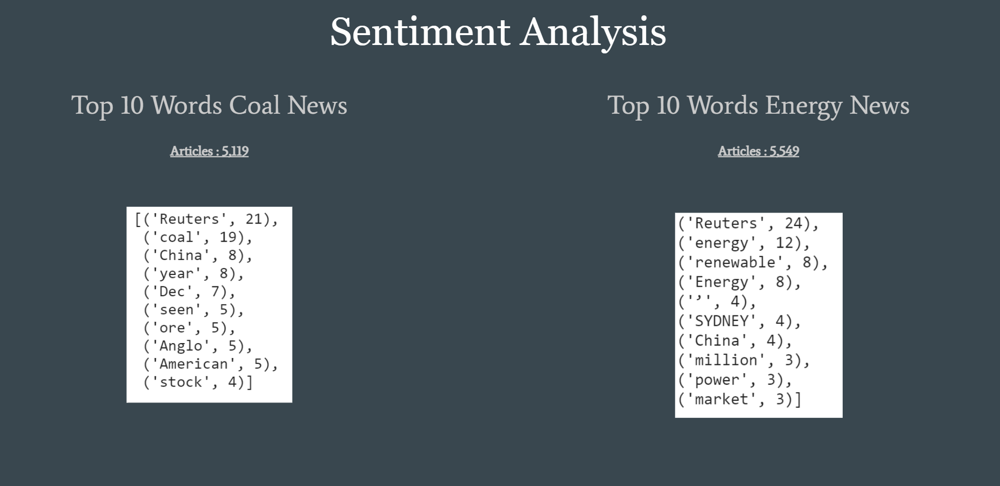
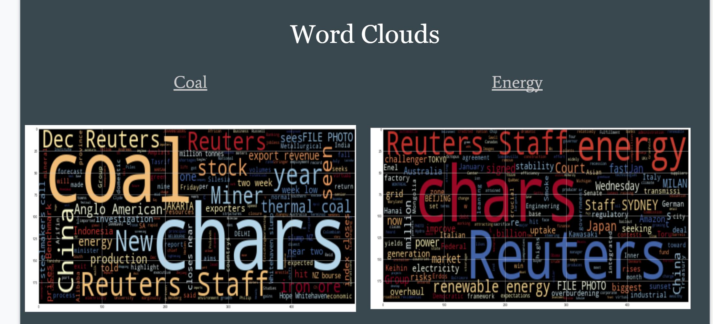
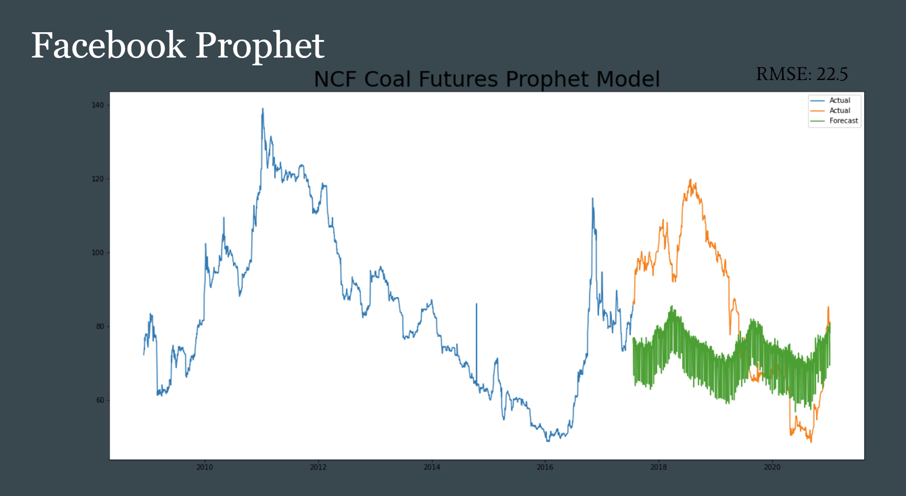
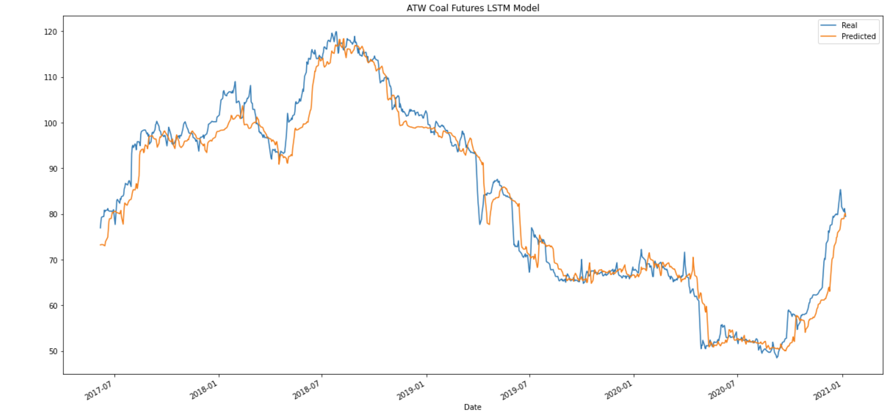
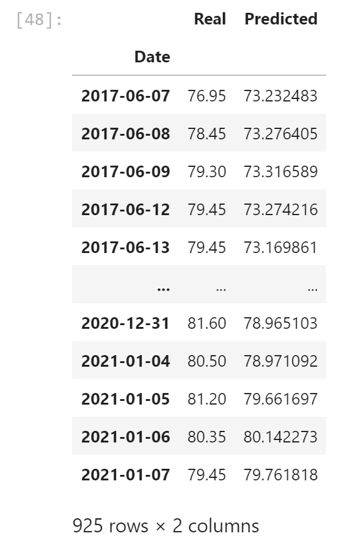

# Coal_Futures

[]
# Background 
  Our Team Nico, Adam , & Etienne are interested in seeing how different Machine Learning models can be used to build a picture of future price trends and action in a given security.
In this case, we chose to take a look into coal as a commodity, examining sentiment in coal, while applying Machine Learning models to price action in a given market, specifically NCF Coal Futures (Coal Futures traded in Newcastle, Australia) from Dec 2008-Jan-2021.

---

# Machine Models 
- Sentiment Analysis
- Facebook Prophet
- Long Short Term Memory (LSTM)

---

## Setiment Analysis    /         Nico 
   With NLP you would need to gather news articles about coal and energy for contrast. 
  Analyzing over 5,000+ articles WITH NEWSAPI will give a good range of coverage in the analytical process.
  Found the top 10 words in the articles with N-Gram Frequency Analysis which directed us into what is going on with coal prices.
  Created a word cloud for further analysis into the articles. 

[]

[]

---

## Articles 

Found articles correlating to the sentiment analysis; which lead us to a series of articales that showed the clashing events between China and Australia.

[]

-Follow Left To Right-

Article 1 October
•	Beijing imposed 200% tariffs on Australia’s wine export due to anti-dumping investigations. 
•	 That is 40% of Australia’s wine exports, and China is one of the biggest consumers of wine.

Article 2 November 
•	China cut’s trade deals with other countries with a limited import quota but leaves Australia out of the trade deal.
•	China being the biggest coal consumers in the world and leaving Australia out of the deal has caused a loss of 14Billlion annually 44% loss in coal exports. 
•	President of China plans to take the country into a new age of carbon neutrality by 2026. Analysts say it is an ambitious goal, but what would need done is the complete stop of building more coal plants and investing in renewable energy products. 

[]

-Follow Left To Right-

Article 3 & 4 January
•	50 ships carrying Australian coal still stranded off the China Coast. 
•	China tells utilities to stop trading with Australia.
•	China head of states deny political strife cause of black out’s in major cities.  
•	Several major cities in China have reportedly gone dark as authorities limit power usage, citing a shortage of coal.

---

## Models

### Facebook Prophet       /         Etienne

Prophet is a forecasting tool used to produce time series analysis that can be altered at the user’s preference.
It allows for quick adjustments to account for trend, seasonality, and holidays.
Users can change the growth trend, changepoints, intervals, regression, and saturation. 
Excels with flexibility in seasonality and historical trends.

[]

As you can see the model did not do well at all,  this model is underfit.

### LSTM       /        Adam

Long short-term memory (LSTM) is an artificial recurrent neural network (RNN) architecture used in the field of deep learning. 
LSTM networks are well-suited to classifying, processing and making predictions based on time series data, since there can be lags of unknown duration between important events in a time series.

[]

This model was a better predictor, almost spot on.  

[]

---

## Conclusion

Using sentiment analysis gives a picture towards what might be the micro/macro narratives influencing the movement in price in coal markets, e.g. China’s position as a key import market.

Machine learning models perhaps offer more insight into understanding trends, where perhaps not giving clues into forecasting future movements into price action. 
Compared to the FB Prophet, LSTM models can give a more accurate account of trends, in the same way as widely-used (but lagging) indicators.

