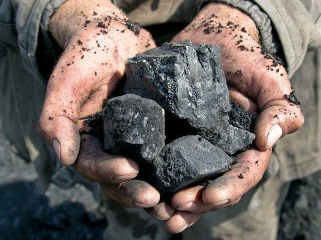

# Coal_Futures

[]
# Background 
 Interested in seeing how different Machine Learning models can be used to build a picture of future price trends and action in a given security.
In this case, we chose to take a look into coal as a commodity, examining sentiment in coal, while applying Machine Learning models to price action in a given market, specifically NCF Coal Futures (Coal Futures traded in Newcastle, Australia) from Dec 2008-Jan-2021.

---

# Machine Models 
- Sentiment Analysis
- Facebook Prophet
- Long Short Term Memory (LSTM)

---

## Setiment Analysis 
  With NLP you would need to gahter news articles about coal and energy for contrast. 
  Analyizing over 5,000+ articles WITH NEWSAPI will give a good range of covereage in the analytical process.
  Found the the top 10 words in the articles with N-Gram Frequency Analysis which directed us into what is going on with coal prices.
  Created a word cloud for further analysis inot the articles. 
  

